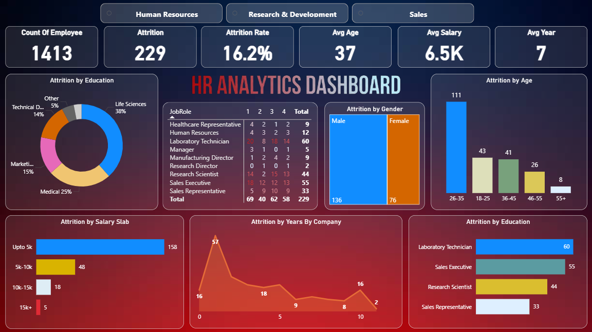

# 🧑‍💼 HR Analytics Dashboard | Power BI

A fully interactive and visually compelling **HR Analytics Dashboard** built using Power BI.  
This dashboard provides deep insights into employee attrition, workforce demographics, job roles,  
salary distribution, and experience levels — helping organizations understand and reduce employee turnover.

---

## 🚀 Dashboard Preview

---

## 📌 Key Metrics

- **Total Employees:** 1413  
- **Total Attrition:** 229  
- **Attrition Rate:** 16.2%  
- **Average Age:** 37  
- **Average Salary:** 6.5K  
- **Average Years at Company:** 7  

These KPIs give a clear snapshot of the organization’s workforce health and attrition trends.

---

## 📊 Visual Insights

### **1️⃣ Attrition by Education**
Shows which education groups experience higher attrition  
(Life Sciences, Medical, Technical Degree, Marketing, etc.).

### **2️⃣ Attrition by Gender**
Breakdown of attrition count by Male vs Female employees.

### **3️⃣ Attrition by Age Group**
Identifies the age brackets with highest turnover  
(26–35 age group shows the highest attrition).

### **4️⃣ Attrition by Job Role**
Detailed table showing attrition distribution by job category.

### **5️⃣ Attrition by Salary Slab**
Shows how salary range impacts employee turnover  
(e.g., maximum attrition occurs in the “Upto 5K” slab).

### **6️⃣ Attrition by Years at Company**
Highlights how long-term vs short-term employees vary in attrition trends.

### **7️⃣ Attrition by Education (Bar Chart)**
Job role–specific insight into which roles are most affected  
(e.g., Laboratory Technician, Sales Executive, Research Scientist).

---

## 🎯 Purpose of the Dashboard

This dashboard helps organizations:
- Identify root causes of attrition  
- Analyze demographic and job role patterns  
- Improve HR decision-making  
- Understand workforce risk areas  
- Build retention strategies for high-risk segments  

---

## 🛠 Tools Used

- **Power BI Desktop**  
- DAX Measures  
- Custom Visual Design  

---

## 
If you liked this dashboard, **don't forget to ⭐ star the repository!**

